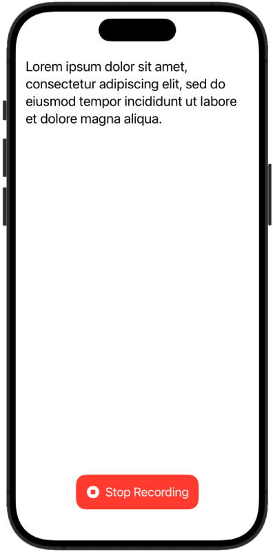

### 🍦 VanillaSpeechRecognition

A 1:1 (or, as close to as possible) "vanilla" implementation of the [TCA SpeechRecognition](https://github.com/pointfreeco/swift-composable-architecture/tree/1.14.0/Examples/SpeechRecognition) app (v1.14.0)

It is 100% compatible with Swift 6, Xcode 16, and iOS 18, and does not use any third-party dependencies.

This implementation also leverages the most modern features of Swift and SwiftUI including: the `@Observable` macro, `@Entry` ([backported to iOS 13](https://developer.apple.com/documentation/swiftui/entry())) for EnvironmentValues, and [Swift Testing](https://developer.apple.com/xcode/swift-testing/).

#### Comparison

| Metric                      | 🍦       | TCA             |
| --------------------------- | ------- | --------------- |
| Dependencies                | 0       | 18              |
| Warnings                    | 0       | 50              |
| Build Time "Cold" (seconds) | 1.5     | 41.5            |
| Build Time "Warm" (seconds) | 0.1     | 0.5             |
| Indexing Time               | Minimal | Several minutes |
| Lines of Code\*             | 393     | 573             |

\*Lines of code is calculated by:

```zsh
% find . -name '*.swift' | xargs wc -l
      56 ./VanillaSpeechRecognitionTests/VanillaSpeechRecognitionTests.swift
       5 ./VanillaSpeechRecognition/EnvironmentValues+.swift
      90 ./VanillaSpeechRecognition/SpeechRecognitionResult.swift
       7 ./VanillaSpeechRecognition/SpeechRecognitionError.swift
     105 ./VanillaSpeechRecognition/SpeechRecognitionView.swift
     117 ./VanillaSpeechRecognition/SpeechRecognitionService.swift
      13 ./VanillaSpeechRecognition/VanillaSpeechRecognitionApp.swift
     393 total
```

#### Screenshot


